# Propuesta Económica – Curso de IA en Turismo

## 📋 Tabla de Contenido

- [Resumen](#resumen)
- [Cobro Total](#cobro-total)
- [Cobro por Econova (por hora persona)](#cobro-por-econova-por-hora-persona)
- [Cobro de los Docentes (2 docentes)](#cobro-de-los-docentes-2-docentes)
- [Margen Bruto (Cobro Total – Cobro Econova por persona)](#margen-bruto-cobro-total--cobro-econova-por-persona)
- [Utilidad Econova (Margen Bruto – Cobro de los 2 Docentes)](#utilidad-econova-margen-bruto--cobro-de-los-2-docentes)
- [Desglose Final (Ejemplo con Cobro Total de 15 MCOP)](#desglose-final-ejemplo-con-cobro-total-de-15-mcop)
- [Desglose Final (Ejemplo con Cobro Total de 18 MCOP)](#desglose-final-ejemplo-con-cobro-total-de-18-mcop)
- [Notas](#notas)

## 📝 Resumen

Se propone un curso de IA en Turismo con un cobro total (estimado) entre 15 y 18 millones de pesos (MCOP). A continuación se detalla el desglose y la distribución de los ingresos, teniendo en cuenta que Econova cobra 8 horas (a 35000 pesos la hora persona) y se incluye el cobro de 2 docentes. Se descuenta del cobro total el cobro de Econova por persona (es decir, 8 h × 35000 COP = 280000 COP por persona, multiplicado por el número de asistentes, por ejemplo 35 personas, lo que da 9,8 MCOP). El margen bruto (cobro total – cobro Econova por persona) se reparte entre los dos docentes (cobro total de los docentes: 4,5 MCOP) y el remanente (margen bruto – cobro de los dos docentes) es la utilidad Econova. En esta propuesta, el docente (o los dos docentes) cobran en total 4,5 millones de pesos.

## 💰 Cobro Total

- Cobro total (estimado): entre 15 y 18 millones de pesos (MCOP).

## 💵 Cobro por Econova (por hora persona)

- Econova cobra 35000 pesos la hora persona.
- Se dictan 8 horas en total.
- Por lo tanto, Econova cobra (por persona) 8 h × 35000 COP = 280000 COP.
- Se estima que el curso se dicta a un grupo de entre 30 y 40 personas (por ejemplo, 35 personas).
- El cobro total por Econova (por hora persona) es: 35 personas × 280000 COP = 9,8 millones de pesos (MCOP).

## 👨‍🏫 Cobro de los Docentes (2 docentes)

- Se incluyen 2 docentes, cobrando en total 4,5 millones de pesos (4,5 MCOP).

## 📊 Margen Bruto (Cobro Total – Cobro Econova por persona)

- Margen Bruto (MCOP) = Cobro Total – Cobro Econova por persona.
- Si el cobro total es de 15 MCOP, el margen bruto es: 15 – 9,8 = 5,2 MCOP.
- Si el cobro total es de 18 MCOP, el margen bruto es: 18 – 9,8 = 8,2 MCOP.

## 📈 Utilidad Econova (Margen Bruto – Cobro de los 2 Docentes)

- Utilidad Econova (MCOP) = Margen Bruto – Cobro de los 2 Docentes.
- Si el margen bruto es de 5,2 MCOP, la utilidad Econova es: 5,2 – 4,5 = 0,7 MCOP.
- Si el margen bruto es de 8,2 MCOP, la utilidad Econova es: 8,2 – 4,5 = 3,7 MCOP.

## 📋 Desglose Final (Ejemplo con Cobro Total de 15 MCOP)

| Concepto | Monto (MCOP) |
|----------|-------------|
| Cobro Total | 15 |
| Cobro Econova (por persona, 35 personas × 280000 COP) | 9,8 |
| Margen Bruto (Cobro Total – Cobro Econova por persona) | 5,2 |
| Cobro de los 2 Docentes | 4,5 |
| Utilidad Econova (Margen Bruto – Cobro de los 2 Docentes) | 0,7 |

## 📋 Desglose Final (Ejemplo con Cobro Total de 18 MCOP)

| Concepto | Monto (MCOP) |
|----------|-------------|
| Cobro Total | 18 |
| Cobro Econova (por persona, 35 personas × 280000 COP) | 9,8 |
| Margen Bruto (Cobro Total – Cobro Econova por persona) | 8,2 |
| Cobro de los 2 Docentes | 4,5 |
| Utilidad Econova (Margen Bruto – Cobro de los 2 Docentes) | 3,7 |

## 📝 Diagrama de Desglose (Flujo de Ingresos)

```mermaid
flowchart TD
    A["Cobro Total (15 o 18 MCOP)"] --> B["Cobro Econova (por persona, 9,8 MCOP)"]
    A --> C["Margen Bruto (Cobro Total – Cobro Econova por persona)"]
    C --> D["Cobro de los 2 Docentes (4,5 MCOP)"]
    C --> E["Utilidad Econova (Margen Bruto – Cobro de los 2 Docentes)"]
```

## 📌 Notas

- Econova cobra 8 horas a 35000 pesos la hora persona (por persona, Econova cobra 280000 COP).
- Se incluyen 2 docentes, cobrando en total 4,5 millones de pesos (4,5 MCOP). En esta propuesta, el docente (o los dos) cobran en total 4,5 millones de pesos.
- El margen bruto (Cobro Total – Cobro Econova por persona) se reparte entre los dos docentes (4,5 MCOP) y el remanente (margen bruto – cobro de los dos docentes) es la utilidad Econova.
- Se recomienda revisar y ajustar los valores según la duración del curso y el número final de asistentes. 